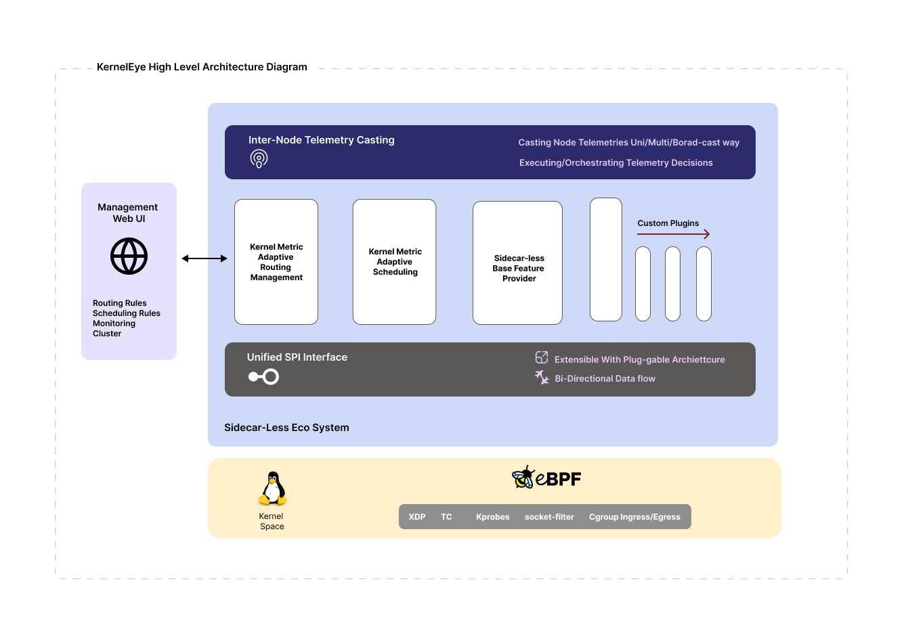
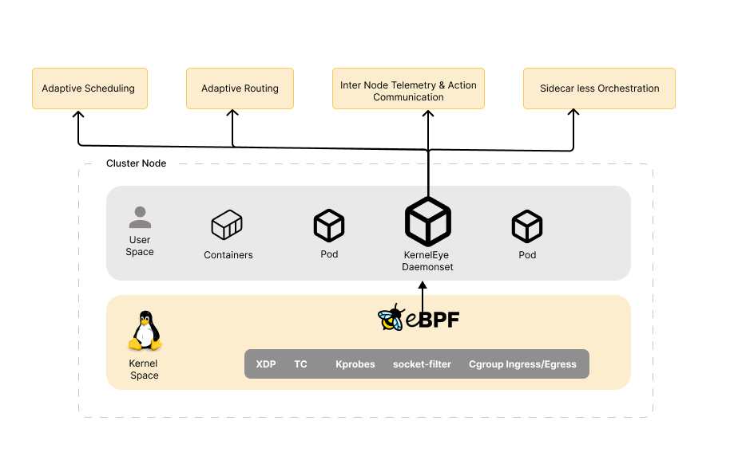

# Kubernetes Runtime-Aware eBPF Orchestration

## Architectural Optimization of Kubernetes using Sidecar-less Orchestration with Runtime-Aware Intelligent Telemetry via eBPF

**Project ID:** 25-26J-434

This project implements a sidecar-less service mesh architecture for Kubernetes using eBPF (Extended Berkeley Packet Filter) to provide runtime telemetry collection without the overhead of traditional sidecar proxies.

## Table of Contents

- [Architecture Overview](#architecture-overview)
  - [High-Level System Architecture](#high-level-system-architecture)
  - [Cluster Node Logical View](#cluster-node-logical-view)
  - [System Architecture Principles](#system-architecture-principles)
- [How It Works: eBPF Data Collection Pipeline](#how-it-works-ebpf-data-collection-pipeline)
  - [Kernel-Level Instrumentation (Zero Application Changes)](#1-kernel-level-instrumentation-zero-application-changes)
  - [Userspace Collection (Go Daemon)](#2-userspace-collection-go-daemon)
  - [REST API Exposure (HTTP/JSON)](#3-rest-api-exposure-httpjson)
  - [Frontend Visualization (React Dashboard)](#4-frontend-visualization-react-dashboard)
- [System Components](#system-components)
  - [Component 1: eBPF Daemon Layer](#component-1-ebpf-daemon-layer-implemented)
  - [Component 2: Intelligent Traffic Routing](#component-2-intelligent-traffic-routing-implemented)
  - [Component 3: Runtime-Aware Autoscaling](#component-3-runtime-aware-autoscaling-implemented)
  - [Component 4: Node-to-Node Communication](#component-4-node-to-node-communication-implemented)
- [Component Setup and Running Guide](#component-setup-and-running-guide)
  - [Component 1: eBPF Daemon Layer Setup](#component-1-ebpf-daemon-layer-setup)
    - [Prerequisites](#prerequisites-1)
    - [Complete Setup (Automated)](#complete-setup-automated)
    - [Running Component 1](#running-component-1)
    - [Component 1 Verification](#component-1-verification)
  - [Component 2: Intelligent Traffic Routing Setup](#component-2-intelligent-traffic-routing-setup)
    - [Cilium Installation](#cilium-installation-with-localredirectpolicy)
    - [Setup Component 2](#setup-component-2)
    - [Running Component 2](#running-component-2)
    - [Component 2 Verification](#component-2-verification)
  - [Component 3: Runtime-Aware Autoscaling Setup](#component-3-runtime-aware-autoscaling-setup)
    - [MongoDB Setup](#mongodb-setup)
    - [Configure Component 3](#configure-component-3)
    - [Running Component 3](#running-component-3)
    - [Component 3 Verification](#component-3-verification)
  - [Component 4: Node-to-Node Communication Setup](#component-4-node-to-node-communication-setup)
    - [Setup Component 4](#setup-component-4)
    - [Running Component 4](#running-component-4)
    - [Component 4 Verification](#component-4-verification)
  - [Complete System Setup (All Components)](#complete-system-setup-all-components)
- [Prerequisites](#prerequisites)
  - [System Requirements](#system-requirements)
  - [Required Tools](#required-tools)
- [Quick Start Guide](#quick-start-guide)
  - [Complete Setup (One Command)](#complete-setup-one-command)
  - [Start Frontend Dashboard](#start-frontend-dashboard)
  - [Quick Rebuild (Without Recreating Cluster)](#quick-rebuild-without-recreating-cluster)
  - [Deploy Sample Services (DNS Traffic Generators)](#step-4-deploy-sample-services-dns-traffic-generators)
  - [Deploy Node-to-Node Communication (Component 4 - Optional)](#step-7-deploy-node-to-node-communication-component-4---optional)
  - [Verify Everything is Working](#step-8-verify-everything-is-working)
- [Using Make Commands (Alternative)](#using-make-commands-alternative)
- [Port-Forward Watchdog (Auto-Restart)](#port-forward-watchdog-auto-restart)
- [Testing Different Services](#testing-different-services)
- [Troubleshooting](#troubleshooting)
  - [Daemon Not Starting](#daemon-not-starting)
  - [No Metrics Showing](#no-metrics-showing)
  - [Dashboard Not Loading](#dashboard-not-loading)
  - [Port-Forward Connection Issues](#port-forward-connection-issues)
- [Component Integration](#component-integration)
  - [For Internal Components: Direct Function Calls](#for-internal-components-direct-function-calls-recommended)
  - [For External Tools: HTTP API Endpoints](#for-external-tools-http-api-endpoints)
  - [Sample API Responses](#sample-api-responses)
    - [Node-Level Metrics](#1-node-level-metrics-get-metricsjson)
    - [Per-Pod DNS Metrics](#2-per-pod-dns-metrics-get-apidnspods)
    - [Cluster Topology](#3-cluster-topology-get-apiclustertopology)
- [Using This Data in Other Components](#using-this-data-in-other-components)
  - [Example 1: Intelligent Traffic Routing](#example-1-intelligent-traffic-routing)
  - [Example 2: Latency-Aware Scheduling](#example-2-latency-aware-scheduling)
  - [Example 3: Multi-Cluster Federation](#example-3-multi-cluster-federation)
- [Key Advantages for Component Developers](#key-advantages-for-component-developers)
- [Project Structure](#project-structure)
- [Development](#development)
  - [Building Individual Components](#building-individual-components)
  - [Debugging](#debugging)
  - [Adding New Telemetry](#adding-new-telemetry)
- [Metrics Collected](#metrics-collected)
  - [DNS Latency](#dns-latency)
  - [TCP RTT (Round-Trip Time)](#tcp-rtt-round-trip-time)
- [Data Flow: From Kernel to Dashboard](#data-flow-from-kernel-to-dashboard)
- [Data Types and Precision](#data-types-and-precision)
- [Roadmap](#roadmap)
- [Cleanup](#cleanup)
  - [Stop Everything and Clean Up](#stop-everything-and-clean-up)
  - [Quick Cleanup Command](#quick-cleanup-command)
- [Monitoring and Debugging](#monitoring-and-debugging)
  - [View Live Metrics](#view-live-metrics)
  - [Performance Testing](#performance-testing)
- [References](#references)
- [License](#license)
- [Author](#author)

## Architecture Overview

This system implements a sidecar-less orchestration framework for Kubernetes that leverages eBPF (Extended Berkeley Packet Filter) to provide runtime-aware telemetry collection and intelligent traffic management without the overhead of traditional sidecar proxies. The architecture is built around a pluggable, extensible design that enables dynamic component integration and runtime adaptation.

### High-Level System Architecture



The high-level architecture diagram illustrates the complete system design, emphasizing extensibility and modularity:

**Management Web UI (Frontend Layer)**
- Provides a unified web interface for system management and monitoring
- Enables configuration of routing rules, scheduling policies, and cluster-wide settings
- Displays real-time metrics, topology information, and system health status
- Supports interactive rule creation and policy enforcement through an intuitive dashboard
- Communicates with backend services via RESTful APIs and WebSocket connections for real-time updates

**Kernel Metric Adaptive Routing Management**
- Implements intelligent traffic routing based on real-time network metrics
- Consumes telemetry data from eBPF collectors to make routing decisions
- Dynamically adjusts traffic paths based on latency, packet loss, and network conditions
- Integrates with Kubernetes service mesh and load balancing mechanisms

**Kernel Metric Adaptive Scheduling**
- Provides latency-aware pod scheduling capabilities
- Utilizes network and system performance metrics to optimize pod placement
- Scores nodes based on runtime telemetry rather than static configurations
- Enables workload distribution that minimizes latency and maximizes resource utilization

**Multi-Cluster Coordination**
- Facilitates communication and coordination across multiple Kubernetes clusters
- Enables federated metrics aggregation and cross-cluster decision making
- Supports distributed policy enforcement and state synchronization
- Provides a foundation for multi-cluster service mesh implementations

**Sidecar-less Base Feature Provider**
- Core system component that delivers essential orchestration capabilities without sidecar overhead
- Integrates directly with the Linux kernel via eBPF programs
- Provides unified telemetry collection and action execution framework
- Serves as the foundation for all extensible components

**Extensible Architecture with Unified SPI Interface**
- Demonstrates the pluggable architecture design pattern central to this system
- The Unified SPI (Service Provider Interface) provides a standardized contract for all components
- Enables dynamic plugin discovery and registration at runtime
- Allows new functionality to be added without modifying core system code
- Supports hot-plugging of components for zero-downtime updates

**Custom Plugins**
- Represents the extensibility mechanism for third-party and user-defined functionality
- Plugins implement the Unified SPI Interface to integrate seamlessly with the core system
- Can add new metric collectors, routing algorithms, scheduling strategies, or communication protocols
- Examples include specialized collectors for application-specific metrics, custom routing policies, or integration with external monitoring systems

### Cluster Node Logical View



The logical view diagram depicts the runtime architecture within a single Kubernetes cluster node, showing the interaction between user space and kernel space components:

**User Space Components**

*Containers and Pods*
- Application workloads running in isolated container environments
- Standard Kubernetes pods that require no modification or instrumentation
- Applications benefit from transparent telemetry collection without code changes

*KernelEye DaemonSet*
- Runs as a DaemonSet pod on each node in the cluster
- Acts as the central coordination point for telemetry collection and orchestration actions
- Communicates with eBPF programs in kernel space via ring buffers and maps
- Aggregates metrics, enriches data with Kubernetes metadata, and exposes APIs for consumption
- Handles inter-node communication for cluster-wide coordination

*Inter Node Telemetry and Action Communication*
- Enables peer-to-peer communication between nodes in the cluster
- Facilitates sharing of telemetry data and coordination of orchestration actions
- Supports broadcast, unicast, and multicast messaging patterns
- Enables distributed decision-making without centralized coordination overhead

**Kernel Space Components**

*eBPF Programs*
- Instrument the Linux kernel to collect telemetry and execute actions at the kernel level
- Attach to various kernel hooks and tracepoints to observe system behavior
- Execute with minimal overhead, providing high-performance data collection
- Run in a secure, sandboxed environment verified by the kernel's verifier

*eBPF Program Types and Attachment Points*
- **XDP (eXpress Data Path)**: Ultra-fast packet processing at the network driver level, enabling line-rate packet filtering and manipulation
- **TC (Traffic Control)**: Network traffic shaping and filtering at the network stack level, allowing bandwidth limiting and packet classification
- **Kprobes**: Dynamic tracing of kernel functions, enabling observation of system calls and internal kernel operations
- **Socket Filter**: Filtering and monitoring of network socket operations, providing visibility into application-level network behavior
- **Cgroup Ingress/Egress**: Resource tracking and control at the cgroup level, enabling per-container and per-pod resource monitoring

**External Integration Points**

*Sidecar-less Orchestration*
- Integration with external orchestration systems that consume telemetry and execute actions
- Enables coordination with cluster autoscalers, service mesh control planes, and other orchestration tools
- Provides APIs for programmatic access to metrics and control actions

*Adaptive Scheduling*
- External scheduling systems that leverage node-level metrics for intelligent workload placement
- Receives aggregated telemetry data to make scheduling decisions based on real-time conditions
- Enables dynamic scheduling policies that adapt to changing cluster conditions

*Adaptive Routing*
- External routing systems that utilize network metrics for traffic steering decisions
- Consumes real-time latency and performance data to optimize request routing
- Enables traffic policies that respond to network conditions automatically

### System Architecture Principles

**Pluggable Interface Design**
The system implements a Service Provider Interface (SPI) pattern that allows components to be dynamically discovered and integrated. All collectors, routing algorithms, scheduling strategies, and communication protocols implement a common interface, enabling runtime composition of functionality.

**Zero Application Impact**
All telemetry collection occurs at the kernel level via eBPF, requiring no modification to application code. Applications run unmodified while the system transparently observes their behavior through kernel instrumentation.

**Sidecar-less Architecture**
Unlike traditional service mesh implementations that inject sidecar containers into each pod, this system uses kernel-level instrumentation and a single DaemonSet per node, eliminating per-pod resource overhead and network complexity.

**Real-time Processing**
Telemetry data flows directly from kernel space to user space via efficient ring buffers, enabling sub-second latency for metrics collection and decision-making. This real-time capability enables immediate response to changing conditions.

**Bi-directional Capability**
The system not only collects telemetry (read operations) but also executes actions at the kernel level (write operations), enabling true bidirectional communication with the kernel for both observation and control.

**Scalability and Performance**
The kernel-level implementation provides minimal CPU and memory overhead, allowing the system to scale to large clusters with thousands of pods while maintaining high performance. The efficient eBPF data structures and direct kernel integration eliminate the need for intermediate processing layers.

## How It Works: eBPF Data Collection Pipeline

### 1. **Kernel-Level Instrumentation** (Zero Application Changes)

The system uses **eBPF (Extended Berkeley Packet Filter)** to instrument the Linux kernel at runtime:

```c
// ebpf/component-1-daemon/dns_latency.c

SEC("kprobe/udp_sendmsg")  // ← Attach to kernel function
int dns_start_probe(struct sock *sk) {
    u64 timestamp = bpf_ktime_get_ns();  // ← Nanosecond precision
    // Store start time
}

SEC("kprobe/udp_recvmsg")  // ← Attach to kernel function
int dns_end_probe(struct sock *sk) {
    u64 latency = end_time - start_time;  // ← Calculate in kernel
    bpf_ringbuf_submit(event);            // ← Send to userspace
}
```

**Key Points:**
- Runs **directly in the Linux kernel** (not userspace)
- **Zero overhead** - no sidecar containers
- Captures **real network latency** from kernel network stack
- Works for **all pods** without modification

### 2. **Userspace Collection** (Go Daemon)

The Go daemon reads events from the eBPF ring buffer:

```go
// daemon/pkg/telemetry/dns_latency_collector.go

func StartDNSLatencyCollector() {
    rd, _ := ringbuf.NewReader(rbMap)  // ← Read from kernel
    
    for {
        record, _ := rd.Read()  // ← Blocking read
        event := parseDNSEvent(record.RawSample)
        
        // Aggregate metrics
        updateMetrics(event.LatencyNs)      // Node-level
        updatePodMetrics(event.SourceIP)    // Pod-level
    }
}
```

**Data Enrichment:**
- Maps pod **IP addresses → Pod names** via Kubernetes API
- Aggregates metrics per pod and node
- Calculates min/max/avg statistics

### 3. **REST API Exposure** (HTTP/JSON)

Metrics are exposed via RESTful API for other components:

```go
// daemon/pkg/api/api.go

GET /metrics/json              // Node + Pod metrics
GET /api/dns/pods              // Per-pod DNS metrics
GET /api/cluster/topology      // Cluster structure
GET /metrics                   // Prometheus format
```

**Example Response:**
```json
{
  "dns": {
    "total_events": 1523,
    "avg_latency_us": 245.32,
    "pods": {
      "default/web-app": {
        "total_events": 842,
        "avg_latency_us": 198.45
      }
    }
  }
}
```

### 4. **Frontend Visualization** (React Dashboard)

Real-time dashboard consumes the API:

```typescript
// Polls API every 3 seconds
const { metrics } = useMetrics(3000);

// Displays:
- Node-level DNS latency graphs
- Per-pod DNS latency charts
- Real-time metrics updates
- Cluster topology information
```

## System Components

The system is composed of four main components that work together to provide comprehensive runtime-aware orchestration for Kubernetes clusters. Each component addresses a specific aspect of cluster management while leveraging the telemetry data collected by Component 1.

### Component 1: eBPF Daemon Layer (Implemented)


**Purpose:** Provides sidecar-less telemetry collection at the kernel level using eBPF instrumentation, eliminating the overhead and complexity of traditional sidecar-based service mesh architectures.

**Technology Stack:**
- eBPF programs written in C for kernel-level instrumentation
- Go daemon for userspace telemetry collection and aggregation
- Kubernetes DaemonSet for deployment across cluster nodes
- REST API for exposing metrics to other components
- React dashboard for real-time visualization

**Internal Architecture: Unified SPI Interface**


Component 1 implements a pluggable architecture using a Unified Service Provider Interface (SPI) that enables extensibility and modularity. The architecture diagram illustrates the three-layer design that spans from user space through the eBPF layer into kernel space.

**User Space Layer:**
- **Plugins**: The topmost layer consists of multiple plugin instances that implement specific functionality. Plugins can be dynamically added to extend system capabilities without modifying core code. Each plugin implements the Unified SPI Interface contract.
- **Core Component**: The central coordination layer that manages all system operations:
  - **Execution Engine**: Controls the lifecycle of all plugins, including initialization, startup, shutdown, and hot-reloading. It orchestrates plugin execution and manages dependencies between plugins.
  - **Base Plugins**: Fundamental plugins that provide core system functionality, such as DNS latency collection, RTT measurement, TCP metrics gathering, and scheduling latency monitoring.
  - **Plugin Registry**: A centralized registry that tracks all registered plugins, enabling dynamic discovery and lookup. Plugins register themselves at runtime using the registry pattern, allowing the system to discover available functionality without hardcoded dependencies.
- **Common High Level Interface (SPI)**: The standardized interface that all plugins must implement. This interface defines the contract for plugin interaction, including methods for initialization, metric collection, subscription management, and lifecycle control. The SPI abstraction enables the core system to interact with plugins uniformly, regardless of their specific implementation.

**eBPF Layer (Interface Between User and Kernel Space):**
- **Verifier**: A critical security component that validates eBPF programs before they are loaded into the kernel. The verifier ensures programs are safe, terminate properly, do not access unauthorized memory, and follow kernel safety rules. This prevents malicious or buggy programs from crashing or compromising the kernel.
- **eBPF Runtime**: The execution environment where verified eBPF programs run. This runtime provides the infrastructure for program loading, JIT compilation, and execution within the kernel context while maintaining isolation and safety guarantees.
- **eBPF Maps**: Shared data structures that enable communication between eBPF programs running in the kernel and user-space applications. Maps also facilitate data sharing between different eBPF programs. Types include ring buffers for event streaming, hash maps for key-value storage, and array maps for indexed data access.

**Kernel Space Layer:**
The kernel space contains various hook points where eBPF programs can attach to observe or modify system behavior:

- **Networking Hooks**: Enable network-level instrumentation and control:
  - XDP (eXpress Data Path): Ultra-fast packet processing at the network driver level
  - TC (Traffic Control): Network traffic shaping and filtering at the network stack
  - Socket Filter: Filtering and monitoring of socket operations
  - Socket Lookup: Custom socket lookup and routing decisions
  - Cgroup Ingress/Egress: Per-container and per-pod network control
  - TCP Congestion Control: Custom congestion control algorithms
  - Socket Operations: Monitoring and modifying socket-level operations

- **Tracing Hooks**: Provide visibility into system and application behavior:
  - Tracepoints: Static kernel instrumentation points with stable API
  - Kprobes: Dynamic kernel function tracing (used for DNS latency measurement)
  - Fentry/Fexit: Function entry and exit tracing with minimal overhead
  - Uprobes: User-space function tracing
  - USDT (User Statically Defined Tracing): Application-defined trace points

- **Security Hooks**: Enable security policy enforcement and monitoring:
  - LSM (Linux Security Modules): Security policy enforcement at kernel level
  - Seccomp: System call filtering and sandboxing

- **Storage and File System Hooks**: Enable file system and storage monitoring:
  - XRP (eXpress Resource Path): Fast path for file system operations
  - eBPF for FUSE: File system in user space extensions

- **Scheduling Hooks**: Provide process scheduling visibility and control:
  - SCHED-EXT: Extensible scheduling framework for custom scheduling policies

- **Testing and Reliability Hooks**:
  - Fault Injection: Ability to inject faults for resilience testing

- **Runtime Feature Hooks**: Extend kernel functionality dynamically:
  - Freplace: Function replacement for hot-patching
  - Iterators: Efficient data structure iteration
  - Timer: Kernel timer integration for periodic tasks

**How the Architecture Enables Extensibility:**

1. **Plugin Development**: New functionality can be added by creating a plugin that implements the Unified SPI Interface. The plugin defines its metric type, implements collection methods, and registers itself with the Plugin Registry.

2. **Dynamic Registration**: Plugins register themselves at runtime through the Plugin Registry. The Execution Engine discovers registered plugins and manages their lifecycle without requiring core system changes.

3. **Interface Abstraction**: The Common High Level Interface (SPI) provides a uniform contract for all plugins. This abstraction allows the core system to interact with different plugin implementations through the same interface, enabling polymorphism and runtime substitution.

4. **Kernel Hook Selection**: When implementing a new metric collector, developers choose appropriate kernel hooks based on the type of observation needed. For example, DNS latency uses Kprobes on UDP functions, while network packet filtering uses XDP or TC hooks.

5. **Data Flow**: Telemetry data flows from kernel hooks through eBPF programs, into eBPF Maps (such as ring buffers), to user-space collectors, through the Plugin Registry, and finally to consumers via REST API or real-time subscriptions.

6. **Hot-Plugging**: The architecture supports adding or removing plugins at runtime without stopping the system. The Execution Engine handles plugin lifecycle transitions gracefully, ensuring continuous operation.

This architecture demonstrates how Component 1 achieves its design goals: extensibility through plugins, safety through eBPF verification, efficiency through kernel-level instrumentation, and flexibility through a unified interface that accommodates diverse telemetry collection needs.

**Key Features:**
- DNS latency measurement via kprobe instrumentation on `udp_sendmsg` and `udp_recvmsg` kernel functions
- TCP RTT (Round-Trip Time) measurement via kprobe on `tcp_connect` and `tcp_finish_connect`
- TCP metrics collection including retransmissions, packet loss, and connection state transitions
- CPU scheduling latency monitoring via tracepoints
- Disk I/O metrics collection at the container level
- Node system metrics including CPU, memory, and network statistics
- Per-pod and node-level metrics aggregation with real-time updates
- REST API supporting both JSON and Prometheus formats
- WebSocket support for real-time metric streaming
- Kubernetes API integration for automatic pod discovery and IP-to-pod mapping
- Container-level metric correlation via PID namespace tracking
- React dashboard with real-time graphs and topology visualization

**Metrics Collected:**
- DNS latency (nanosecond precision)
- TCP RTT and connection metrics
- TCP retransmissions and packet loss
- CPU scheduling latency
- Disk I/O operations and latency
- Socket counts (TCP/UDP)
- Packet distribution statistics
- Service health indicators
- NAT metadata

### Component 2: Intelligent Traffic Routing (Implemented)


**Purpose:** Enables dynamic traffic routing based on real-time telemetry data, automatically redirecting traffic to optimal backends when network conditions degrade.

**Technology Stack:**
- Cilium LocalRedirectPolicy (LRP) for traffic steering
- Go-based routing plugin integrated with Component 1
- Rule-based routing policies with threshold evaluation
- Latency-based pod selection algorithm

**Key Features:**
- Real-time latency monitoring and threshold evaluation
- Automatic traffic redirection when metrics exceed configured thresholds
- Integration with Cilium CNI for kernel-level traffic steering
- Support for multiple backend selection strategies
- Best-pod selection based on lowest latency metrics
- Time-to-live (TTL) based policy expiration
- Configurable routing rules via JSON policies
- Frontend integration for rule management through UI

**How It Works:**
1. Monitors DNS and RTT metrics from Component 1 in real-time
2. Evaluates configured routing rules against current metric values
3. When thresholds are violated, applies Cilium LocalRedirectPolicy
4. Redirects traffic from frontend service to selected backend pods
5. Automatically removes policies after TTL expiration
6. Re-evaluates and reapplies as conditions change

**Routing Decision Logic:**
- Compares current metric values against violation thresholds
- Selects optimal backend pods based on latency metrics
- Applies label selectors to target specific pod sets
- Supports multiple backend candidates with winner selection
- Handles policy lifecycle management automatically

### Component 3: Runtime-Aware Autoscaling (Implemented)

**Status:** Fully Implemented with MongoDB Integration

**Purpose:** Implements automatic Kubernetes workload autoscaling driven by eBPF telemetry metrics instead of traditional CPU/memory-based scaling, enabling more responsive and network-aware scaling decisions.

**Technology Stack:**
- MongoDB for rule storage and persistence
- Go-based scaling controller integrated with Component 1
- Kubernetes Deployment API for replica management
- REST API for rule CRUD operations
- React frontend for rule configuration

**Key Features:**
- Telemetry-driven autoscaling using DNS latency, RTT, TCP metrics, and scheduling latency
- Rule-based scaling policies with flexible operators (greater than, less than, equals)
- Configurable scaling steps and replica limits (min/max)
- Real-time metric evaluation with sub-5-second polling intervals
- MongoDB-backed rule persistence with change stream notifications
- Support for per-deployment scaling rules
- Multiple metric type support (DNS, RTT, TCP, scheduling latency)
- Frontend dashboard for rule management and visualization
- Deployment metrics tracking with last action history

**How It Works:**
1. Frontend creates/updates scaling rules via REST API
2. Rules are persisted in MongoDB with enabled/disabled status
3. Scaling controller runs continuous evaluation loop (every 5 seconds)
4. Controller fetches enabled rules and evaluates against latest metrics
5. When rule conditions match, controller calls Kubernetes API to scale deployment
6. Scaling actions respect min/max replica constraints and step sizes
7. Frontend displays current replicas, latest metrics, and scaling history

**Scaling Rule Structure:**
- Target deployment selection via namespace and deployment name
- Metric type selection (DNS latency, RTT, TCP metrics, etc.)
- Threshold values and comparison operators
- Scaling action (scale up, scale down) with step size
- Min and max replica constraints
- Enabled/disabled toggle for rule activation

**Supported Metrics for Scaling:**
- DNS average latency (dns_avg_latency_us)
- RTT average latency (rtt_avg_rtt_us)
- TCP smoothed RTT (tcp_srtt_us)
- TCP retransmission rate (tcp_retrans_rate)
- CPU scheduling latency (sched_avg_runqueue_latency_us)
- TCP packet loss rate (tcp_packet_loss_rate)

### Component 4: Node-to-Node Communication (Implemented)


**Purpose:** Enables peer-to-peer communication between cluster nodes for distributed coordination, federated decision-making, and inter-node telemetry sharing without requiring a centralized control plane.

**Technology Stack:**
- Go-based peer-to-peer daemon
- REST API for communication primitives
- Kubernetes DaemonSet deployment
- WebSocket support for real-time updates
- React dashboard for interactive control

**Key Features:**
- BROADCAST messaging to all nodes in the cluster
- UNICAST messaging to specific target nodes
- MULTICAST messaging to groups of nodes
- Multiple event types (HANDSHAKE, SCHEDULING, STATE_UPDATE, METRIC_UPDATE, DISCOVERY)
- Node discovery and health tracking
- Real-time communication logs and statistics
- RESTful API for programmatic access
- Interactive frontend dashboard for manual testing
- Support for single-node and multi-node cluster configurations

**Communication Primitives:**
- **BROADCAST:** Send message to all nodes simultaneously
- **UNICAST:** Send message to a single target node
- **MULTICAST:** Send message to multiple selected nodes

**Event Types:**
- **HANDSHAKE:** Initial node discovery and connection establishment
- **SCHEDULING:** Coordination messages for scheduling decisions
- **STATE_UPDATE:** Node state changes and health updates
- **METRIC_UPDATE:** Sharing of telemetry data between nodes
- **DISCOVERY:** Cluster topology and node discovery messages

**How It Works:**
1. DaemonSet pod runs on each node with node IP configuration
2. Nodes maintain peer list via ConfigMap or discovery mechanism
3. REST API endpoints accept messages with event types and payloads
4. Messages are routed to target nodes based on communication type
5. Receiving nodes process messages and log actions
6. Frontend dashboard provides interactive interface for testing
7. Statistics and logs are exposed via API for monitoring

**Use Cases:**
- Coordinating eBPF program updates across nodes
- Sharing local metrics aggregations between nodes
- Implementing distributed consensus for routing decisions
- Cross-node health checks and status updates
- State synchronization across the cluster
- Multi-cluster federation coordination

## Component Setup and Running Guide

This section provides detailed instructions for setting up and running each component of the system. Components can be deployed independently or together as a complete system.

### Component 1: eBPF Daemon Layer Setup

Component 1 is the foundation of the system and must be deployed first. It provides telemetry data for all other components.

#### Prerequisites
- Kubernetes cluster (Kind, Minikube, or production cluster)
- Linux kernel >= 5.4 with BTF support
- Root access for eBPF operations
- Clang, LLVM, and libbpf-dev installed

#### Complete Setup (Automated)

**Option 1: One-Command Setup**
```bash
# Complete automated setup: creates cluster, builds, and deploys
./rebuild-cluster-and-daemon.sh
```

**Option 2: Step-by-Step Manual Setup**
```bash
# 1. Create Kind cluster with eBPF support
kind create cluster --name ebpf-cluster --config k8s/kind-config.yaml

# 2. Build eBPF programs
make build-ebpf
# Or manually:
cd ebpf/component-1-daemon
clang -O2 -g -target bpf -D__TARGET_ARCH_x86 \
  -I../common \
  -c dns_latency.c -o dns_latency.o
cd ../..

# 3. Build Go daemon
make build-daemon
# Or manually:
cd daemon
go build -o ebpf-daemon ./cmd/daemon
cd ..

# 4. Build Docker image
docker build -t ebpf-daemon:latest daemon/

# 5. Load image into Kind cluster
kind load docker-image ebpf-daemon:latest --name ebpf-cluster

# 6. Deploy to Kubernetes
kubectl apply -f k8s/namespace.yaml
kubectl apply -f k8s/daemonset.yaml

# 7. Verify deployment
kubectl get pods -n ebpf-telemetry
kubectl logs -n ebpf-telemetry -l app=ebpf-daemon
```

#### Running Component 1

**Start Frontend Dashboard:**
```bash
# Terminal 1: Port-forward API (optional: use watchdog)
./scripts/port-forward-watchdog.sh &
# Or manually:
kubectl -n ebpf-telemetry port-forward svc/ebpf-daemon 8080:8080 &

# Terminal 2: Start React frontend
cd frontend
npm install  # First time only
npm run dev
```

**Access Dashboard:**
- Frontend: http://localhost:5000
- API Health: http://localhost:8080/health
- API Metrics: http://localhost:8080/api/metrics

**Test Metrics Collection:**
```bash
# Deploy test pods that generate DNS traffic
kubectl apply -f k8s/simple-test-pods.yaml

# Verify metrics are being collected
curl http://localhost:8080/api/metrics | jq '.node.dns_latency'

# Check pod-level metrics
curl http://localhost:8080/api/dns/pods | jq '.pods'
```

#### Component 1 Verification

**Verify eBPF Programs Loaded:**
```bash
# Check daemon logs for successful eBPF loading
kubectl logs -n ebpf-telemetry -l app=ebpf-daemon | grep "eBPF"

# Verify programs in kernel (from inside pod)
kubectl exec -n ebpf-telemetry -it $(kubectl get pod -n ebpf-telemetry -l app=ebpf-daemon -o name) -- \
  ls -la /sys/fs/bpf
```

**Verify Metrics Collection:**
```bash
# Check API endpoints
curl http://localhost:8080/health  # Should return "OK"
curl http://localhost:8080/api/metrics  # Should return JSON metrics
curl http://localhost:8080/api/cluster/topology  # Should return cluster structure
```

### Component 2: Intelligent Traffic Routing Setup

Component 2 requires Component 1 to be running and provides dynamic traffic routing based on telemetry data.

#### Prerequisites
- Component 1 deployed and running
- Cilium CNI installed with LocalRedirectPolicy enabled
- Test services deployed for routing experiments

#### Cilium Installation with LocalRedirectPolicy

```bash
# Install Cilium using Helm with LocalRedirectPolicy enabled
helm repo add cilium https://helm.cilium.io/
helm repo update

# Install Cilium with required features
helm install cilium cilium/cilium \
  --namespace kube-system \
  --set localRedirectPolicy=true \
  --set k8sServiceHost=kind-control-plane \
  --set k8sServicePort=6443

# Wait for Cilium to be ready
kubectl wait --for=condition=ready pod -l k8s-app=cilium -n kube-system --timeout=300s

# Verify LocalRedirectPolicy CRD is available
kubectl api-resources | grep LocalRedirect
```

#### Setup Component 2

**Step 1: Deploy Test Services**
```bash
# Build test service images
docker build -t service-a:latest examples/service-a/
docker build -t service-b:latest examples/service-b/
docker build -t service-c:latest examples/service-c/

# Load images into Kind cluster
kind load docker-image service-a:latest service-b:latest service-c:latest --name ebpf-cluster

# Deploy test services
kubectl apply -f k8s/test-services.yaml

# Verify services are running
kubectl get pods -n test-services
kubectl get svc -n test-services
```

**Step 2: Configure Port Forward for Telemetry API**
```bash
# Ensure Component 1 API is accessible
kubectl -n ebpf-telemetry port-forward svc/ebpf-daemon 8080:8080
```

**Step 3: Review Routing Rule Configuration**
```bash
# Examine example routing rule
cat k8s/component-2/redirect-rule.example.json
```

**Step 4: Apply Routing Rule**
```bash
# Run the routing helper script
./k8s/component-2/apply-local-redirect.sh

# Or with custom rule file
./k8s/component-2/apply-local-redirect.sh /path/to/custom-rule.json
```

#### Running Component 2

**Verify Routing Policy:**
```bash
# Check if LocalRedirectPolicy was created
kubectl -n test-services get ciliumlocalredirectpolicy

# Describe the policy
kubectl -n test-services describe ciliumlocalredirectpolicy redirect-service-a-to-b
```

**Test Traffic Redirection:**
```bash
# Run test client from within cluster
kubectl -n test-services run curl-test --rm -it --restart=Never \
  --image=curlimages/curl -- \
  sh -c "while true; do curl -s service-a:5000; sleep 2; done"

# Check backend logs to see traffic destination
kubectl logs -n test-services -l app=service-b -f
```

**Monitor Routing Decisions:**
```bash
# Check telemetry metrics to see what triggered routing
curl http://localhost:8080/api/metrics | jq '.node.rtt'
curl http://localhost:8080/api/dns/pods | jq '.pods'

# Monitor routing script logs
tail -f /tmp/routing-helper.log  # If logging enabled
```

#### Component 2 Verification

**Verify Policy Application:**
```bash
# Check policy status
kubectl -n test-services get ciliumlocalredirectpolicy -o yaml

# Verify traffic is being redirected (check backend pod logs)
kubectl logs -n test-services -l app=service-b --tail=50
```

### Component 3: Runtime-Aware Autoscaling Setup

Component 3 requires Component 1 to be running and MongoDB for rule storage. It provides telemetry-driven autoscaling.

#### Prerequisites
- Component 1 deployed and running
- MongoDB deployed (can use provided MongoDB deployment)
- Deployment with pods to scale

#### MongoDB Setup

**Option 1: Deploy MongoDB in Cluster**
```bash
# Deploy MongoDB using provided manifest
kubectl apply -f k8s/mongo.yaml

# Wait for MongoDB to be ready
kubectl wait --for=condition=ready pod -l app=mongo -n rules-db --timeout=300s

# Verify MongoDB connection
kubectl exec -n rules-db -it $(kubectl get pod -n rules-db -l app=mongo -o name) -- \
  mongosh --eval "db.adminCommand('ping')"
```

**Option 2: Use External MongoDB**
```bash
# Set environment variable in daemon deployment
kubectl set env deployment/ebpf-daemon -n ebpf-telemetry \
  MONGO_URI=mongodb://external-mongo-host:27017
```

#### Configure Component 3

**Update Daemon Configuration:**
```bash
# Verify MongoDB environment variables in daemon
kubectl get deployment ebpf-daemon -n ebpf-telemetry -o yaml | grep MONGO

# Update if needed (default values should work with cluster MongoDB)
kubectl set env deployment/ebpf-daemon -n ebpf-telemetry \
  MONGO_URI=mongodb://mongo.rules-db.svc.cluster.local:27017 \
  MONGO_DB=rulesdb \
  MONGO_COLLECTION=scaling_rules
```

**Restart Daemon to Enable Scaling Controller:**
```bash
# Component 3 is already integrated in Component 1 daemon
# Just ensure daemon is running with MongoDB connection
kubectl rollout restart deployment/ebpf-daemon -n ebpf-telemetry

# Verify scaling controller started
kubectl logs -n ebpf-telemetry -l app=ebpf-daemon | grep -i "scaling\|mongo"
```

#### Running Component 3

**Create Scaling Rule via API:**
```bash
# Create a scaling rule
curl -X POST http://localhost:8080/api/scaling/rules \
  -H "Content-Type: application/json" \
  -d '{
    "name": "scale-on-high-dns-latency",
    "namespace": "default",
    "deployment": "my-app",
    "metric": "dns_avg_latency_us",
    "operator": ">",
    "threshold": 100.0,
    "action": "scale_up",
    "step": 1,
    "minReplicas": 1,
    "maxReplicas": 10,
    "enabled": true
  }'
```

**Create Scaling Rule via Frontend:**
1. Access frontend dashboard: http://localhost:5000
2. Navigate to "Scaling" tab
3. Click "Create New Rule"
4. Fill in rule parameters:
   - Deployment namespace and name
   - Metric type (DNS latency, RTT, TCP, etc.)
   - Threshold value and operator
   - Scaling action and step size
   - Min and max replicas
5. Click "Save" to create rule

**Monitor Scaling Actions:**
```bash
# List all scaling rules
curl http://localhost:8080/api/scaling/rules | jq

# Get latest metrics for a deployment
curl http://localhost:8080/api/scaling/metrics/latest | jq

# Check deployment replicas
kubectl get deployment my-app -n default -o jsonpath='{.spec.replicas}'
kubectl get deployment my-app -n default -o jsonpath='{.status.replicas}'
```

#### Component 3 Verification

**Verify Scaling Controller:**
```bash
# Check controller logs
kubectl logs -n ebpf-telemetry -l app=ebpf-daemon | grep -i scaling

# Verify rules are loaded from MongoDB
kubectl exec -n rules-db -it $(kubectl get pod -n rules-db -l app=mongo -o name) -- \
  mongosh rulesdb --eval "db.scaling_rules.find().pretty()"
```

**Test Scaling:**
```bash
# Deploy a test application
kubectl create deployment test-app --image=nginx:latest -n default
kubectl expose deployment test-app --port=80 -n default

# Create a scaling rule for the deployment
curl -X POST http://localhost:8080/api/scaling/rules \
  -H "Content-Type: application/json" \
  -d '{
    "name": "test-scaling",
    "namespace": "default",
    "deployment": "test-app",
    "metric": "dns_avg_latency_us",
    "operator": ">",
    "threshold": 50.0,
    "action": "scale_up",
    "step": 1,
    "minReplicas": 1,
    "maxReplicas": 5,
    "enabled": true
  }'

# Watch deployment replicas change
watch -n 2 'kubectl get deployment test-app -n default'
```

### Component 4: Node-to-Node Communication Setup

Component 4 enables peer-to-peer communication between cluster nodes and can work independently or with Component 1.

#### Prerequisites
- Multi-node Kubernetes cluster (or single-node for testing)
- Node IPs configured correctly
- Network connectivity between nodes

#### Setup Component 4

**Step 1: Create Multi-Node Cluster (if needed)**
```bash
# Create 3-node Kind cluster
kind create cluster --name ebpf-cluster --config k8s/kind-config.yaml

# Verify all nodes are ready
kubectl get nodes -o wide
```

**Step 2: Build Component 4 Daemon**
```bash
cd component-4-node-communication

# Build Docker image
docker build -t p2p-node:v3 .

# Load image into Kind cluster
kind load docker-image p2p-node:v3 --name ebpf-cluster

cd ..
```

**Step 3: Configure Node Peers**
```bash
# Get node IPs
kubectl get nodes -o jsonpath='{range .items[*]}{.metadata.name}{"\t"}{.status.addresses[?(@.type=="InternalIP")].address}{"\n"}{end}'

# Update peers ConfigMap if needed
# Edit component-4-node-communication/peers-configmap.yaml
# Update node IPs to match your cluster
```

**Step 4: Deploy Component 4**
```bash
cd component-4-node-communication

# Deploy peers ConfigMap
kubectl apply -f peers-configmap.yaml

# Deploy DaemonSet
kubectl apply -f daemonset.yaml

# Verify deployment (should have one pod per node)
kubectl get pods -n kube-system -l app=p2p-node -o wide

cd ..
```

#### Running Component 4

**Test BROADCAST Communication:**
```bash
# Get a node IP
NODE_IP=$(kubectl get nodes -o jsonpath='{.items[0].status.addresses[?(@.type=="InternalIP")].address}')

# Send broadcast message to all nodes
curl -X POST http://$NODE_IP:8080/broadcast \
  -H "Content-Type: application/json" \
  -d '{
    "event": "HANDSHAKE",
    "payload": {"message": "Hello from broadcast test"},
    "action": "NONE"
  }'

# Check logs on all nodes
kubectl logs -n kube-system -l app=p2p-node -f
```

**Test UNICAST Communication:**
```bash
# Get target node IP
TARGET_IP=$(kubectl get nodes -o jsonpath='{.items[1].status.addresses[?(@.type=="InternalIP")].address}')

# Send unicast message to specific node
curl -X POST http://$NODE_IP:8080/unicast \
  -H "Content-Type: application/json" \
  -d '{
    "event": "STATE_UPDATE",
    "targets": ["'$TARGET_IP'"],
    "payload": {"status": "active", "timestamp": "'$(date -u +%Y-%m-%dT%H:%M:%SZ)'"},
    "action": "UPDATE_STATE"
  }'

# Verify message received on target node
kubectl logs -n kube-system -l app=p2p-node --tail=20 | grep "$TARGET_IP"
```

**Test MULTICAST Communication:**
```bash
# Get multiple node IPs
NODE_IP_1=$(kubectl get nodes -o jsonpath='{.items[0].status.addresses[?(@.type=="InternalIP")].address}')
NODE_IP_2=$(kubectl get nodes -o jsonpath='{.items[1].status.addresses[?(@.type=="InternalIP")].address}')

# Send multicast message to selected nodes
curl -X POST http://$NODE_IP_1:8080/multicast \
  -H "Content-Type: application/json" \
  -d '{
    "event": "METRIC_UPDATE",
    "targets": ["'$NODE_IP_1'", "'$NODE_IP_2'"],
    "payload": {"metrics": {"cpu": 50, "memory": 60}},
    "action": "NONE"
  }'
```

**Using Component 4 Dashboard:**
1. Ensure Component 1 is running with port-forward
2. Access frontend: http://localhost:5000
3. Navigate to "Federation" tab
4. View all nodes in the cluster
5. Select communication type (BROADCAST, UNICAST, MULTICAST)
6. Select target nodes (for UNICAST/MULTICAST)
7. Choose event type and enter payload
8. Click "Send" to send message
9. View real-time logs and statistics

#### Component 4 Verification

**Verify Daemon Deployment:**
```bash
# Check pods are running on all nodes
kubectl get pods -n kube-system -l app=p2p-node -o wide

# Verify pod logs show successful startup
kubectl logs -n kube-system -l app=p2p-node --tail=50 | grep -i "started\|ready"
```

**Verify Communication:**
```bash
# Check communication stats endpoint (if available)
curl http://$NODE_IP:8080/api/comm/stats | jq

# Verify messages are being logged
kubectl logs -n kube-system -l app=p2p-node | grep -i "received\|sent"
```

### Complete System Setup (All Components)

To run all components together:

**Step 1: Deploy Component 1 (Foundation)**
```bash
./rebuild-cluster-and-daemon.sh
```

**Step 2: Deploy MongoDB for Component 3**
```bash
kubectl apply -f k8s/mongo.yaml
kubectl wait --for=condition=ready pod -l app=mongo -n rules-db --timeout=300s
```

**Step 3: Install Cilium for Component 2 (if using)**
```bash
helm install cilium cilium/cilium --namespace kube-system \
  --set localRedirectPolicy=true
```

**Step 4: Deploy Component 4**
```bash
cd component-4-node-communication
docker build -t p2p-node:v3 .
kind load docker-image p2p-node:v3 --name ebpf-cluster
kubectl apply -f peers-configmap.yaml
kubectl apply -f daemonset.yaml
cd ..
```

**Step 5: Start Frontend Dashboard**
```bash
./scripts/port-forward-watchdog.sh &
cd frontend && npm install && npm run dev
```

**Step 6: Access All Features**
- Dashboard: http://localhost:5000
- Component 1 Metrics: Dashboard tab
- Component 2 Routing: Routing tab (requires Cilium)
- Component 3 Scaling: Scaling tab
- Component 4 Communication: Federation tab

## Prerequisites

### System Requirements
- Linux kernel ≥ 5.4 with BTF support
- Kubernetes v1.25+
- Root/sudo access for eBPF operations

### Required Tools
```bash
# Ubuntu/Debian
sudo apt update
sudo apt install -y \
    clang \
    llvm \
    libbpf-dev \
    linux-tools-$(uname -r) \
    linux-headers-$(uname -r) \
    golang-go \
    make \
    docker.io

# Verify kernel BTF support
ls /sys/kernel/btf/vmlinux
```

## Quick Start Guide

### Prerequisites

Install required tools:

```bash
# Ubuntu/Debian
sudo apt update
sudo apt install -y \
    clang \
    llvm \
    libbpf-dev \
    linux-tools-$(uname -r) \
    linux-headers-$(uname -r) \
    golang-go \
    make \
    docker.io \
    kubectl \
    kind \
    nodejs \
    npm

# Install Kind (if not available via package manager)
curl -Lo ./kind https://kind.sigs.k8s.io/dl/v0.20.0/kind-linux-amd64
chmod +x ./kind
sudo mv ./kind /usr/local/bin/kind

# Verify kernel BTF support (required for eBPF)
ls /sys/kernel/btf/vmlinux
```

### Complete Setup (One Command)

**For first-time setup or complete rebuild:**

```bash
# Clone the repository
git clone <repository-url>
cd k8s-runtime-aware-ebpf-orchestration

# Make script executable
chmod +x rebuild-cluster-and-daemon.sh

# Run complete setup (creates cluster, builds eBPF, builds daemon, deploys)
./rebuild-cluster-and-daemon.sh
```

This script will:
1. Delete existing cluster (if any)
2. Create new Kind cluster with eBPF support
3. Build all eBPF programs (DNS, RTT, TCP, Scheduling, Disk I/O)
4. Build Go daemon binary
5. Build Docker image
6. Load image into Kind cluster
7. Deploy daemon to Kubernetes
8. Wait for daemon to be ready

**Expected output:**
```
═══════════════════════════════════════════════════════
   REBUILD KIND CLUSTER & DAEMON
═══════════════════════════════════════════════════════

[1/6] Checking for existing cluster...
[2/6] Creating new Kind cluster...
[3/6] Waiting for cluster to be ready...
[4/6] Rebuilding eBPF programs...
[5/6] Rebuilding Go daemon...
[6/6] Building Docker image...
[7/6] Loading image into kind cluster...
[8/6] Deploying daemon...
   Daemon deployed and ready
```

### Start Frontend Dashboard

After the daemon is deployed:

**Option 1: Port-forward with Auto-Restart Watchdog (Recommended)**

```bash
# Terminal 1: Start port-forward watchdog (auto-restarts if connection dies)
./scripts/port-forward-watchdog.sh &
# Or use Makefile:
# make port-forward-watchdog

# Terminal 2: Start frontend
cd frontend
npm install  # First time only
npm run dev
```

**Option 2: Manual Port-Forward**

```bash
# Terminal 1: Port forward (run in background)
kubectl -n ebpf-telemetry port-forward svc/ebpf-daemon 8080:8080 &

# Terminal 2: Start frontend
cd frontend
npm install  # First time only
npm run dev
```

The dashboard will be available at `http://localhost:5000` (or the port shown in terminal).

**Note:** The watchdog script automatically restarts the port-forward within 1 second if it disconnects, preventing connection errors in the frontend. View logs with: `tail -f /tmp/port-forward-watchdog.log`

### Quick Rebuild (Without Recreating Cluster)

If you only need to rebuild the daemon after code changes:

```bash
chmod +x rebuild-daemon.sh
./rebuild-daemon.sh
```

This will:
1. Rebuild eBPF programs
2. Rebuild Go daemon
3. Build Docker image
4. Load into cluster
5. Restart daemon pod

### Step 4: Deploy Sample Services (DNS Traffic Generators)

The sample services continuously generate DNS queries to test the monitoring system.

```bash
# Deploy test pods
kubectl apply -f k8s/simple-test-pods.yaml

# Wait for pods to be ready
kubectl -n dns-test wait --for=condition=ready pod --all --timeout=60s

# Check pod status
kubectl get pods -n dns-test

# View pod logs to see DNS queries
kubectl logs -n dns-test pod-a --tail=10
kubectl logs -n dns-test pod-b --tail=10
kubectl logs -n dns-test pod-c --tail=10
```

**What these pods do:**
- `pod-a`: Queries `kubernetes.default.svc.cluster.local` every 2 seconds
- `pod-b`: Queries `pod-a.dns-test.svc.cluster.local` every 3 seconds  
- `pod-c`: Queries `kube-dns.kube-system.svc.cluster.local` every 4 seconds

**Expected Output:**
```
NAME    READY   STATUS    RESTARTS   AGE
pod-a   1/1     Running   0          30s
pod-b   1/1     Running   0          30s
pod-c   1/1     Running   0          30s
```

### Step 4: Set Up Port Forwarding and Start Dashboard

```bash
# Terminal 2: Start the React dashboard
cd frontend

# Install dependencies (first time only)
npm install

# Start development server
npm run dev
```

**Dashboard will be available at:** `http://localhost:3000`

### Step 7: Deploy Node-to-Node Communication (Component 4 - Optional)

This component enables peer-to-peer communication. It works with single-node clusters for demos and scales to multi-node setups.

```bash
# Build and deploy the P2P daemon
cd component-4-node-communication

# Build the P2P daemon Docker image
docker build -t p2p-node:v3 .

# Load image into Kind cluster
kind load docker-image p2p-node:v3 --name ebpf-cluster

# Deploy the P2P daemon
kubectl apply -f peers-configmap.yaml
kubectl apply -f daemonset.yaml

# Verify deployment
kubectl get pods -n kube-system -l app=p2p-node -o wide
kubectl logs -n kube-system -l app=p2p-node --tail=20

cd ..
```

**What Component 4 provides:**
- **BROADCAST**: Send messages to all nodes
- **UNICAST**: Send messages to a specific node
- **MULTICAST**: Send messages to groups of nodes
- **P2P Architecture**: Node-to-node communication
- **REST API**: HTTP endpoints on port 8080
- **Dashboard Integration**: Interactive control panel

**Using the Node Communication Dashboard:**

1. Open **Federation** tab in React dashboard (`http://localhost:5000`)
2. **View Node Status**: See all nodes with IP, status, and pod counts
3. **Select Communication Type**: BROADCAST, UNICAST, or MULTICAST
4. **Interactive Node Selection**: Click nodes to select (green highlight + checkmark)
5. **Choose Event Type**: HANDSHAKE, SCHEDULING, STATE_UPDATE, METRIC_UPDATE, DISCOVERY
6. **Enter Payload**: JSON or plain text messages
7. **Send & Monitor**: Real-time logs with success/failure indicators

**Dashboard Features:**
- Live stats: Total nodes, ready nodes, messages sent
- Interactive node cards with visual feedback
- Color-coded communication types
- Success/failure indicators
- Real-time message logs
5. **Interactive node selection**:
   - Click nodes to select them (they turn green and scale up)
   - Selected nodes show a checkmark
   - Works with UNICAST (1 node) and MULTICAST (multiple nodes)
6. **Enter payload** as JSON or plain text
7. **Click "Send"** to broadcast the message
8. **View real-time logs** with success/failure indicators

**Dashboard Features:**
- Stats cards showing total nodes, ready nodes, messages sent, and last sent time
- Interactive node cards that respond to clicks
- Color-coded communication types
- Success/failure indicators in logs
- Real-time message logging with timestamps
- Clear logs button

**Testing P2P Communication via CLI:**
```bash
# Get a node IP
NODE_IP=$(kubectl get nodes -o jsonpath='{.items[0].status.addresses[?(@.type=="InternalIP")].address}')

# Send broadcast message to all nodes
curl -X POST http://$NODE_IP:8080/broadcast \
  -H "Content-Type: application/json" \
  -d '{"event": "HANDSHAKE", "payload": {"message": "Hello from all nodes!"}, "action": "NONE"}'

# Send unicast message to specific node
curl -X POST http://$NODE_IP:8080/unicast \
  -H "Content-Type: application/json" \
  -d '{"event": "STATE_UPDATE", "targets": ["172.18.0.2"], "payload": {"status": "active"}, "action": "UPDATE_STATE"}'

# Send multicast message to group of nodes
curl -X POST http://$NODE_IP:8080/multicast \
  -H "Content-Type: application/json" \
  -d '{"event": "METRIC_UPDATE", "targets": ["172.18.0.2", "172.18.0.3"], "payload": {"metrics": "data"}, "action": "NONE"}'

# View logs on receiving nodes
kubectl logs -n kube-system -l app=p2p-node -f
```

**Use Cases:**
- Coordinating eBPF program updates across nodes
- Sharing local metrics aggregations between nodes
- Implementing distributed consensus for routing decisions
- Cross-node health checks and status updates
- State synchronization across the cluster

### Step 8: Verify Everything is Working

```bash
# Terminal 3: Test the API
curl http://localhost:8080/health
# Output: OK

# Get metrics with pod details
curl http://localhost:8080/metrics/json | jq '.dns.pods'

# Get cluster topology
curl http://localhost:8080/api/cluster/topology | jq '.nodes[0].name'
```

**Expected JSON Output:**
```json
{
  "dns-test/pod-a": {
    "total_events": 28,
    "avg_latency_us": 364.13,
    "max_latency_us": 697.05,
    "min_latency_us": 80.08
  },
  "dns-test/pod-b": {
    "total_events": 20,
    "avg_latency_us": 412.18,
    "max_latency_us": 974.39,
    "min_latency_us": 125.92
  }
}
```

## You're Now Running!

You should now have:

**Kind Cluster**: Running with eBPF support  
**eBPF Daemon**: Collecting DNS latency from kernel  
**Sample Services**: 3 pods generating DNS traffic  
**REST API**: Available at `http://localhost:8080`  
**React Dashboard**: Available at `http://localhost:3000`
**P2P Communication** (optional): Node-to-node messaging via Federation tab

**Dashboard Features:**
- Real-time DNS latency graphs per node
- Per-pod DNS latency trends
- Cluster information (name, node, pod count)
- Live metric updates every 3 seconds
- Dark theme UI
- **Node Communication Panel** (Federation tab):
  - View all cluster nodes with status
  - Send BROADCAST/UNICAST/MULTICAST messages
  - Real-time communication logs
  - Event-driven message types (HANDSHAKE, SCHEDULING, etc.)

## Using Make Commands (Alternative)

If you prefer using Make:

```bash
# Complete automated setup (recommended)
./rebuild-cluster-and-daemon.sh  # Complete setup: cluster + build + deploy

# Or use Makefile commands
make build-ebpf              # Build eBPF programs only
make build-daemon           # Build Go daemon only
make build-images           # Build all Docker images
make deploy-daemon          # Deploy daemon to cluster
make logs-daemon            # View daemon logs
make port-forward           # Start port forwarding (foreground)
make port-forward-watchdog  # Start port forwarding with auto-restart watchdog (background)
```

## Port-Forward Watchdog (Auto-Restart)

The port-forward connection can sometimes disconnect, causing `ECONNREFUSED` errors in the frontend. The watchdog script automatically monitors and restarts the port-forward within 1 second if it dies.

### Features

- **Fast Recovery**: Checks every 1 second, restarts within 1 second
- **Health Verification**: Verifies port is actually accessible (not just process running)
- **Smart Restart**: Waits for 3 consecutive failures before restarting (prevents flapping)
- **Comprehensive Logging**: All events logged to `/tmp/port-forward-watchdog.log`
- **Clean Shutdown**: Stops port-forward when watchdog exits

### Usage

**Start the watchdog:**

```bash
# Option 1: Direct script
./scripts/port-forward-watchdog.sh &

# Option 2: Makefile
make port-forward-watchdog

# Option 3: Run in foreground (for debugging)
./scripts/port-forward-watchdog.sh
```

**Monitor logs:**

```bash
tail -f /tmp/port-forward-watchdog.log
```

**Stop the watchdog:**

```bash
pkill -f port-forward-watchdog
```

**Check status:**

```bash
# Check if watchdog is running
ps aux | grep port-forward-watchdog

# Check if port-forward is running
ps aux | grep "kubectl.*port-forward.*8080"

# Test API connectivity
curl http://localhost:8080/health
```

### When to Use

- **Development**: When running the frontend locally and experiencing connection drops
- **Long Sessions**: When you need the port-forward to stay connected for extended periods
- **Unstable Networks**: When network conditions cause frequent disconnections
- **Automated Testing**: When you need reliable port-forward for CI/CD pipelines

## Testing Different Services

### Deploy Your Own Services

Any pod making DNS queries will be automatically monitored:

```yaml
apiVersion: v1
kind: Pod
metadata:
  name: my-app
  namespace: default
spec:
  containers:
  - name: app
    image: nginx:latest
    # No changes needed - eBPF monitors automatically!
```

Deploy it:
```bash
kubectl apply -f my-app.yaml

# Wait a few seconds, then check metrics
curl http://localhost:8080/metrics/json | jq '.dns.pods["default/my-app"]'
```

### Scale Test Pods

```bash
# Scale up pod-a (create more DNS traffic)
kubectl scale deployment pod-a --replicas=3 -n dns-test

# Watch metrics increase
watch -n 1 'curl -s http://localhost:8080/metrics/json | jq .dns.total_events'
```

## Troubleshooting

### Daemon Not Starting

```bash
# Check pod status
kubectl get pods -n ebpf-telemetry

# View logs
kubectl logs -n ebpf-telemetry -l app=ebpf-daemon

# Check node has required kernel
kubectl debug node/ebpf-cluster-control-plane -it --image=ubuntu
ls /sys/kernel/btf/vmlinux  # Should exist
```

### No Metrics Showing

```bash
# Verify pods are making DNS queries
kubectl logs -n dns-test pod-a

# Check API is accessible
curl http://localhost:8080/metrics/json

# Verify port-forward is running
lsof -i :8080
```

### Dashboard Not Loading

```bash
# Check frontend is running
lsof -i :3000

# Check API is accessible
curl http://localhost:8080/health

# Restart frontend
cd frontend
npm run dev
```

### Port-Forward Connection Issues

If you're experiencing frequent disconnections (`ECONNREFUSED` errors):

**Use the Auto-Restart Watchdog:**

```bash
# Start the watchdog (automatically restarts port-forward if it dies)
./scripts/port-forward-watchdog.sh &

# Or use Makefile:
make port-forward-watchdog

# View watchdog logs
tail -f /tmp/port-forward-watchdog.log

# Stop watchdog
pkill -f port-forward-watchdog
```

**Manual Troubleshooting:**

```bash
# Check if port-forward is running
ps aux | grep "kubectl.*port-forward.*8080"

# Check if port is accessible
curl http://localhost:8080/health

# Restart port-forward manually
pkill -f "kubectl.*port-forward.*8080"
kubectl -n ebpf-telemetry port-forward svc/ebpf-daemon 8080:8080 > /tmp/port-forward.log 2>&1 &
```

## Component Integration

### **For Internal Components: Direct Function Calls (Recommended)**

Components in this repository can directly import the telemetry package and call functions - **no HTTP, no ports, no configuration needed**:

```go
package mycomponent

import (
    "log"
    "github.com/IrushiGunawardana/k8s-runtime-aware-ebpf-orchestration/daemon/pkg/telemetry"
)

// Example 1: Get current metrics
func SelectBestPod(serviceName string) string {
    // Direct function call - fast, type-safe, no network
    podDNS := telemetry.GetPodDNSMetrics()
    podRTT := telemetry.GetPodRTTMetrics()
    
    bestPod := ""
    minLatency := float64(99999999)
    
    for podKey, dns := range podDNS {
        rtt := podRTT[podKey]
        
        avgDNS := float64(dns.TotalLatencyNs) / float64(dns.TotalEvents)
        avgRTT := float64(0)
        if rtt.TotalEvents > 0 {
            avgRTT = float64(rtt.TotalRTTNs) / float64(rtt.TotalEvents)
        }
        
        combinedLatency := avgDNS + avgRTT
        if combinedLatency < minLatency {
            minLatency = combinedLatency
            bestPod = podKey
        }
    }
    
    log.Printf("Selected: %s (latency: %.2fms)", bestPod, minLatency/1e6)
    return bestPod
}

// Example 2: Subscribe for real-time updates
func WatchMetrics() {
    collector, ok := telemetry.GlobalRegistry.Get(telemetry.MetricTypeDNS)
    if !ok {
        return
    }
    
    updatesChan := collector.Subscribe()
    defer collector.Unsubscribe(updatesChan)
    
    for metric := range updatesChan {
        // Receive push updates as events happen
        if podMetric, ok := metric.(telemetry.PodMetric); ok {
            log.Printf("Pod %s latency update: %+v", podMetric.PodName, podMetric.Value)
            // Make immediate decisions
        }
    }
}
```

**Available Functions:**

| Function | Returns | Description |
|----------|---------|-------------|
| `GetDNSMetrics()` | `DNSMetrics` | Node-level DNS stats |
| `GetPodDNSMetrics()` | `map[string]PodDNSMetrics` | Per-pod DNS (key: "namespace/pod") |
| `GetRTTMetrics()` | `RTTMetrics` | Node-level RTT stats |
| `GetPodRTTMetrics()` | `map[string]PodRTTMetrics` | Per-pod RTT (key: "namespace/pod") |
| `GlobalRegistry.Get(type)` | `Collector` | Get collector for subscriptions |
| `collector.Subscribe()` | `<-chan Metric` | Real-time metric stream (push) |

**Integration Steps:**

1. Import the package:
   ```go
   import "github.com/IrushiGunawardana/k8s-runtime-aware-ebpf-orchestration/daemon/pkg/telemetry"
   ```

2. Call functions directly - that's it! No HTTP client, no port configuration needed.

3. To start your component in the same binary, edit `daemon/cmd/daemon/main.go`:
   ```go
   import "yourpackage/routing"
   
   func main() {
       // ... load eBPF ...
       go telemetry.StartDNSLatencyCollector()
       go telemetry.StartRTTCollector()
       
       // Start your component
       router := routing.NewRouter()
       go router.Start()
       
       // ... rest ...
   }
   ```

See `ARCHITECTURE.md` for detailed design and more examples.

---

### **For External Tools: HTTP API Endpoints**

For external consumers (dashboards, monitoring tools, other applications):

| Endpoint | Method | Description | Use Case |
|----------|--------|-------------|----------|
| `/health` | GET | Health check | Liveness probe |
| `/ready` | GET | Readiness check | Readiness probe |
| `/metrics` | GET | Prometheus format | Monitoring systems (Grafana, Prometheus) |
| `/metrics/json` | GET | JSON format with pod details | Dashboards, custom tools |
| `/api/dns/pods` | GET | Per-pod DNS metrics | Routing decisions, scheduling |
| `/api/rtt/pods` | GET | Per-pod RTT metrics | Performance monitoring |
| `/api/cluster/topology` | GET | Cluster structure | Service mesh, load balancing |

### **Sample API Responses**

#### 1. **Node-Level Metrics** (`GET /metrics/json`)
```json
{
  "timestamp": "2025-12-08T17:00:00Z",
  "dns": {
    "total_events": 1523,
    "avg_latency_us": 245.32,
    "last_latency_us": 189.45,
    "max_latency_us": 1523.67,
    "min_latency_us": 45.12,
    "pods": {
      "default/web-app": {
        "total_events": 842,
        "avg_latency_us": 198.45,
        "max_latency_us": 1200.0,
        "min_latency_us": 45.12
      },
      "default/api-server": {
        "total_events": 681,
        "avg_latency_us": 312.89,
        "max_latency_us": 1523.67,
        "min_latency_us": 89.34
      }
    }
  },
  "rtt": {
    "total_events": 892,
    "avg_rtt_us": 1234.56,
    "last_rtt_us": 1100.00,
    "max_rtt_us": 5000.00,
    "min_rtt_us": 200.00
  }
}
```

#### 2. **Per-Pod DNS Metrics** (`GET /api/dns/pods`)
```json
{
  "pods": {
    "default/web-app": {
      "namespace": "default",
      "pod_name": "web-app",
      "total_events": 842,
      "avg_latency_us": 198.45,
      "last_latency_us": 156.78,
      "max_latency_us": 1200.0,
      "min_latency_us": 45.12
    }
  }
}
```

#### 3. **Cluster Topology** (`GET /api/cluster/topology`)
```json
{
  "nodes": [
    {
      "name": "node-1",
      "ip": "172.18.0.2",
      "status": "Ready",
      "role": "control-plane",
      "pods": [
        {
          "name": "web-app",
          "namespace": "default",
          "ip": "10.244.0.5",
          "status": "Running",
          "service": "web-svc"
        }
      ]
    }
  ]
}
```

## Using This Data in Other Components

### **Example 1: Intelligent Traffic Routing**

Use DNS latency to route traffic to pods with better network performance:

```go
// Component 2: Routing Controller

func SelectBestPod(serviceName string) string {
    resp := httpGet("http://ebpf-daemon:8080/api/dns/pods")
    pods := parsePodMetrics(resp)
    
    // Find pod with lowest DNS latency
    bestPod := ""
    minLatency := math.MaxFloat64
    
    for podKey, metrics := range pods {
        if metrics.AvgLatencyUs < minLatency {
            minLatency = metrics.AvgLatencyUs
            bestPod = podKey
        }
    }
    
    return bestPod  // Route traffic here
}
```

### **Example 2: Latency-Aware Scheduling**

Schedule new pods on nodes with better network performance:

```python
# Component 3: Scheduler Plugin

import requests

def score_node(node_name):
    """Score node based on DNS latency"""
    metrics = requests.get(f"http://ebpf-daemon:8080/metrics/json").json()
    
    # Lower latency = higher score
    avg_latency = metrics['dns']['avg_latency_us']
    score = 100 - (avg_latency / 10)  # Normalize
    
    return max(0, min(100, score))
```

### **Example 3: Multi-Cluster Federation**

Compare network performance across clusters:

```javascript
// Component 4: Federation Controller

async function getClusterHealth(clusterEndpoint) {
    const response = await fetch(`${clusterEndpoint}/metrics/json`);
    const metrics = await response.json();
    
    return {
        cluster: clusterEndpoint,
        dnsLatency: metrics.dns.avg_latency_us,
        rttLatency: metrics.rtt.avg_rtt_us,
        totalPods: Object.keys(metrics.dns.pods).length
    };
}

// Select cluster with best performance
const clusters = await Promise.all([
    getClusterHealth("http://cluster-1:8080"),
    getClusterHealth("http://cluster-2:8080")
]);

const bestCluster = clusters.reduce((prev, curr) => 
    curr.dnsLatency < prev.dnsLatency ? curr : prev
);
```

## Key Advantages for Component Developers

1. **No Kernel Access Required**: Components consume data via REST API
2. **Language Agnostic**: HTTP/JSON works with any programming language
3. **Real-Time Data**: Metrics update continuously (sub-second granularity)
4. **Pod-Level Granularity**: Make decisions per individual pod
5. **Zero Application Changes**: eBPF captures data transparently
6. **Production Ready**: DaemonSet deployment, automatic pod discovery

## Project Structure

```
k8s-runtime-aware-ebpf-orchestration/
├── daemon/                    # Go daemon source code
│   ├── cmd/daemon/           # Main entry point
│   ├── pkg/
│   │   ├── api/              # HTTP API server
│   │   ├── loader/           # eBPF program loader
│   │   ├── plugins/          # Plugin interface
│   │   └── telemetry/        # Telemetry collectors
│   ├── Dockerfile
│   └── go.mod
├── ebpf/                      # eBPF C programs
│   ├── common/               # Shared headers
│   │   ├── dns_latency.h
│   │   ├── maps.h
│   │   └── rtt.h
│   └── component-1-daemon/   # Daemon eBPF programs
│       ├── dns_latency.c
│       ├── rtt.c
│       └── vmlinux.h
├── examples/                  # Test services
│   ├── service-a/
│   └── service-b/
├── k8s/                       # Kubernetes manifests
│   ├── daemonset.yaml
│   ├── test-services.yaml
│   └── namespace.yaml
├── scripts/
│   └── build-ebpf.sh
├── ui/                        # UI components (planned)
├── Makefile
└── README.md
```

## Development

### Building Individual Components

```bash
# eBPF programs only
make build-ebpf

# Go daemon only
make build-daemon

# Docker images
make build-images
```

### Debugging

```bash
# View eBPF program info
sudo bpftool prog list
sudo bpftool map list

# View attached kprobes
cat /sys/kernel/debug/tracing/kprobe_events

# Check ring buffer
sudo bpftool map dump name dns_events
```

### Adding New Telemetry

1. Create new header in `ebpf/common/`
2. Create new eBPF program in `ebpf/component-1-daemon/`
3. Add collector in `daemon/pkg/telemetry/`
4. Update loader in `daemon/pkg/loader/`
5. Add metrics endpoint in `daemon/pkg/api/`

## Metrics Collected

### DNS Latency
- **Source:** kprobe on `udp_sendmsg` and `udp_recvmsg`
- **Metric:** Time between DNS request and response
- **Use Case:** Detect DNS resolution delays

### TCP RTT (Round-Trip Time)
- **Source:** kprobe on `tcp_connect` and `tcp_finish_connect`
- **Metric:** TCP connection establishment time
- **Use Case:** Monitor network latency between services

## Data Flow: From Kernel to Dashboard

```
┌─────────────────────────────────────────────────────────────────┐
│ Step 1: Kernel Instrumentation (eBPF C Code)                    │
│                                                                  │
│  Pod makes DNS query → udp_sendmsg() → kprobe captures start    │
│  DNS response arrives → udp_recvmsg() → kprobe captures end     │
│                                                                  │
│  eBPF Program:                                                   │
│    latency_ns = end_timestamp - start_timestamp                 │
│    event = {pid, source_ip, latency_ns, timestamp}              │
│    bpf_ringbuf_submit(event)  ← Send to userspace               │
└──────────────────────────┬───────────────────────────────────────┘
                           │
                           ▼
┌─────────────────────────────────────────────────────────────────┐
│ Step 2: Userspace Collection (Go Daemon)                        │
│                                                                  │
│  for event := range ringbuffer.Read() {                         │
│    // Aggregate node-level metrics                              │
│    nodeMetrics.TotalEvents++                                    │
│    nodeMetrics.TotalLatency += event.LatencyNs                  │
│                                                                  │
│    // Map IP to pod name via K8s API                            │
│    podName := ipToPodMap[event.SourceIP]  // "default/web-app" │
│                                                                  │
│    // Aggregate per-pod metrics                                 │
│    podMetrics[podName].TotalEvents++                            │
│    podMetrics[podName].TotalLatency += event.LatencyNs          │
│  }                                                               │
└──────────────────────────┬───────────────────────────────────────┘
                           │
                           ▼
┌─────────────────────────────────────────────────────────────────┐
│ Step 3: API Exposure (REST Server)                              │
│                                                                  │
│  HTTP Server (port 8080):                                       │
│    GET /metrics/json → Return aggregated metrics                │
│    GET /api/dns/pods → Return per-pod metrics                   │
│                                                                  │
│  Response:                                                       │
│  {                                                               │
│    "dns": {                                                      │
│      "avg_latency_us": 245.32,  ← Node-level                    │
│      "pods": {                                                   │
│        "default/web-app": {                                      │
│          "avg_latency_us": 198.45  ← Pod-level                  │
│        }                                                         │
│      }                                                           │
│    }                                                             │
│  }                                                               │
└──────────────────────────┬───────────────────────────────────────┘
                           │
                           ▼
┌─────────────────────────────────────────────────────────────────┐
│ Step 4: Frontend Visualization (React)                          │
│                                                                  │
│  useEffect(() => {                                               │
│    setInterval(() => {                                           │
│      fetch('http://localhost:8080/metrics/json')                │
│        .then(data => updateCharts(data))  ← Every 3 seconds     │
│    }, 3000)                                                      │
│  })                                                              │
│                                                                  │
│  Display:                                                        │
│    - Node-level DNS latency chart                               │
│    - Per-pod DNS latency charts                                 │
│    - Real-time metric cards                                     │
│    - Cluster topology info                                      │
└─────────────────────────────────────────────────────────────────┘
```

## Data Types and Precision

| Data Point | Captured At | Precision | Source |
|------------|-------------|-----------|--------|
| **DNS Latency** | Kernel | Nanoseconds | `bpf_ktime_get_ns()` |
| **Timestamp** | Kernel | Nanoseconds | `bpf_ktime_get_ns()` |
| **Source IP** | Kernel | 32-bit | Socket structure |
| **Process ID** | Kernel | 32-bit | `bpf_get_current_pid_tgid()` |
| **Pod Name** | K8s API | String | Pod metadata |
| **Namespace** | K8s API | String | Pod metadata |

**Important Notes:**
- **Latency data** comes from **kernel timestamps** (not API queries)
- **Zero application instrumentation** required
- **Sub-microsecond precision** for latency measurements
- **Kubernetes API** only used for mapping IPs to pod names (enrichment)

## Roadmap

- [x] **Component 1: eBPF Daemon Layer** **COMPLETED**
  - [x] DNS latency collection via kernel probes
  - [x] RTT collection via TCP instrumentation
  - [x] Per-pod metrics aggregation
  - [x] REST API (JSON + Prometheus)
  - [x] Kubernetes DaemonSet deployment
  - [x] React dashboard with real-time graphs
  - [x] Cluster topology API
  - [x] Pod IP auto-discovery
- [ ] Component 2: Intelligent Traffic Routing
  - [ ] Consume DNS latency metrics via API
  - [ ] Implement latency-based routing decisions
  - [ ] Integration with service mesh
- [ ] Component 3: Latency-Aware Scheduling
  - [ ] Custom Kubernetes scheduler
  - [ ] Node scoring based on network metrics
  - [ ] Pod placement optimization
- [ ] Component 4: Multi-Cluster Federation
  - [ ] Cross-cluster metric aggregation
  - [ ] Federated traffic management
  - [ ] Global load balancing
- [ ] Additional Features
  - [ ] Grafana integration
  - [ ] AlertManager integration
  - [ ] Historical data storage
  - [ ] Policy enforcement engine

## Cleanup

### Stop Everything and Clean Up

```bash
# Stop frontend (Ctrl+C in Terminal 2)
# Stop port-forward (Ctrl+C in Terminal 1)

# Delete Kubernetes resources
kubectl delete -f k8s/simple-test-pods.yaml
kubectl delete -f k8s/daemonset.yaml
kubectl delete namespace dns-test ebpf-telemetry

# If you deployed Component 4 (P2P communication)
kubectl delete -f component-4-node-communication/daemonset.yaml
kubectl delete -f component-4-node-communication/peers-configmap.yaml

# Delete Kind cluster
kind delete cluster --name ebpf-cluster

# Clean build artifacts
cd k8s-runtime-aware-ebpf-orchestration
rm -f daemon/ebpf-daemon
rm -f ebpf/component-1-daemon/*.o
rm -rf frontend/node_modules

# Remove Docker images (optional)
docker rmi ebpf-daemon:latest
docker system prune -f
```

### Quick Cleanup Command

```bash
# One-liner to delete everything
kind delete cluster --name ebpf-cluster && \
kubectl config use-context docker-desktop && \
echo "Cleanup complete!"
```

## Monitoring and Debugging

### View Live Metrics

```bash
# Watch metrics update in real-time
watch -n 2 'curl -s http://localhost:8080/metrics/json | jq "{dns: .dns.avg_latency_us, pods: .dns.pods | length}"'

# Stream daemon logs
kubectl logs -n ebpf-telemetry -l app=ebpf-daemon -f

# Check eBPF programs loaded
kubectl exec -n ebpf-telemetry -it $(kubectl get pod -n ebpf-telemetry -l app=ebpf-daemon -o name) -- ls -la /sys/fs/bpf
```

### Performance Testing

```bash
# Generate more DNS traffic
for i in {1..100}; do 
  kubectl run test-$i --image=busybox --restart=Never -- nslookup kubernetes
done

# Watch metrics spike
watch -n 1 'curl -s http://localhost:8080/metrics/json | jq .dns.total_events'

# Cleanup test pods
kubectl delete pod -l run=test
```

## References

1. Lentz et al., "Dissecting Overheads of Service Mesh Sidecars," SoCC 2023
2. Linux Foundation, "Introduction to eBPF," 2021
3. Gregg, "BPF Performance Tools," Addison-Wesley, 2019
4. Cilium Project, "eBPF-based Networking, Security, and Observability"
5. Kubernetes Documentation, "DaemonSet," kubernetes.io/docs/concepts/workloads/controllers/daemonset/

## License

This project is licensed under the MIT License - see the [LICENSE](LICENSE) file for details.

## Authors

**Samarasinghe P. P. (IT 220 36 384)**
- Email: it22036384@my.sliit.lk
- Sri Lanka Institute of Information Technology

**Gunawardana D. D. I. (IT22312426)**
- Email: it22312426@my.sliit.lk
- Sri Lanka Institute of Information Technology

**Aponso G. I. A. (IT22603586)**
- Email: it22603586@my.sliit.lk
- Sri Lanka Institute of Information Technology

**Sashmitha G. C. K. (IT22109262)**
- Email: it22109262@my.sliit.lk
- Sri Lanka Institute of Information Technology

---

*This project is part of undergraduate research (Project ID: 25-26J-434)*
